# PivotDB

Self-hostable multi-engine data platform — **migrate, sync, back up, monitor, and alert** across MongoDB, PostgreSQL, and MySQL from a single web console.

Built for teams that run more than one database engine and don't want to glue together five different vendor tools to keep them in shape.

## What it does

| Capability | Engines | What you get |
|---|---|---|
| **Connections** | Mongo / PG / MySQL | One-click test, encrypted URI storage, replica/cluster awareness |
| **Explore** | Mongo / PG / MySQL | Browse schemas, run queries, inspect documents/rows |
| **Migrate** | All 9 cross-engine directions | Streaming pipeline with schema inference, type translation (Decimal128, JSONB, AUTO_INCREMENT/IDENTITY preserved), per-namespace progress, error surfacing |
| **Sync (CDC)** | Mongo ↔ PG ↔ MySQL | Snapshot + tail using PG logical replication, Mongo change streams, MySQL binlog. Auto-reconnect on flaky cloud connections (Neon free-tier idle drops, etc.) |
| **Protect (Backup/Restore)** | Mongo / PG / MySQL | Native engine tools (`mongodump`, `pg_dump v17`, `mysqldump`), AES-256-GCM encrypted archives, 3-generation retention, restore-to-target with one click |
| **Monitor** | All 3 | Engine-aware Grafana dashboards, live current-ops, slow queries, top tables, replication lag |
| **Alerts** | All 3 | Threshold rules on connections / ops/sec / cache hit / replication lag etc. with duration debounce + email/webhook notifications |

## Screenshots

Captured from a local run against the seeded fixtures in [`dev/test-dbs/`](dev/test-dbs/) — six connections spanning all three engines, three completed cross-engine migrations, and a CDC sync actively tailing.

### Connections

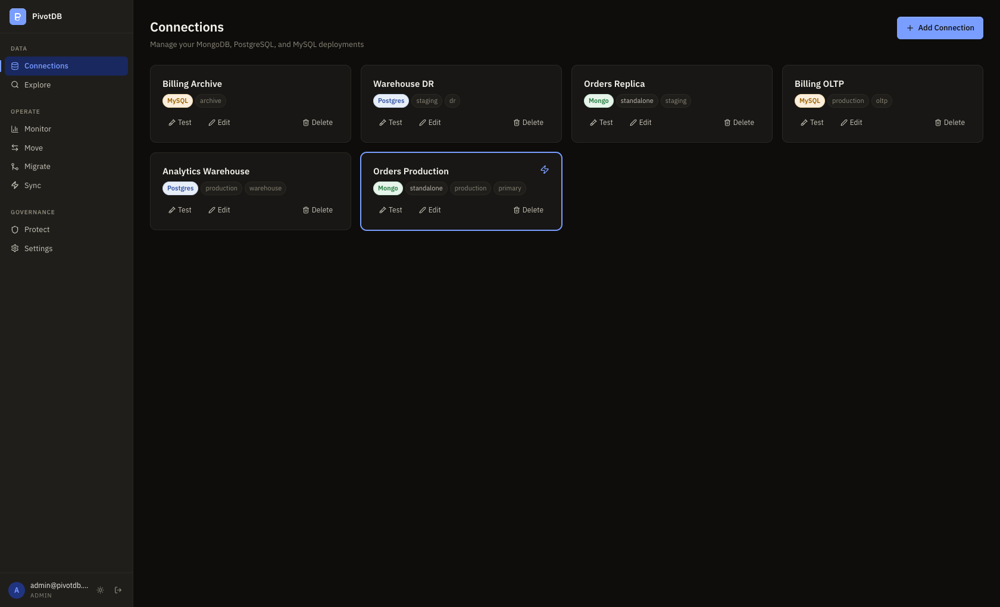

Six databases registered across MongoDB, PostgreSQL and MySQL. Each URI is stored AES-256-GCM encrypted; the badge shows the engine and the chips are free-form tags. **Test** probes the server for version, latency and topology.

### Explore

One explorer shell, two engines. Tabs for Documents / Schema / Aggregate, a filter box, and export — the same component regardless of what is underneath.

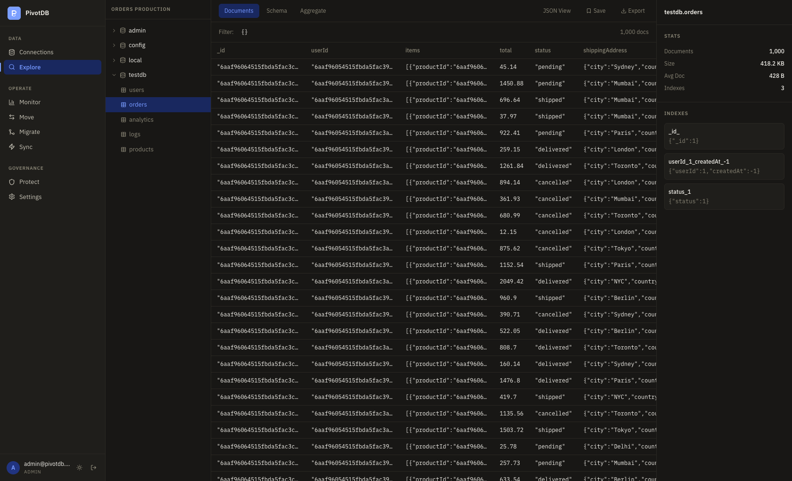

Browsing `testdb.orders` — 1,000 documents, with collection stats (418 KB, 428 B average document) and the three index definitions in the right rail.

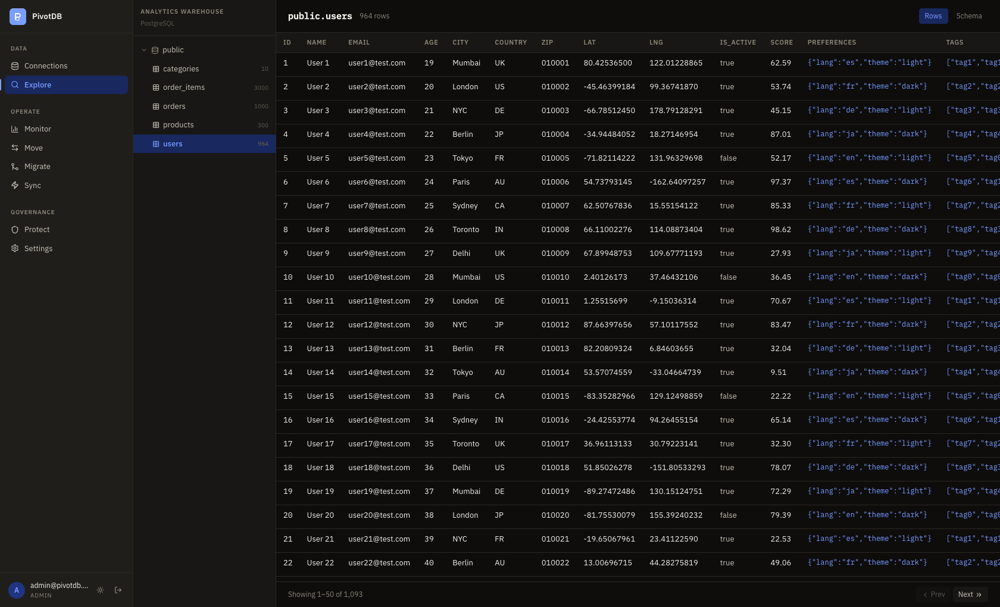

The same view against Postgres: declared columns instead of sampled fields, per-table row counts in the tree, and server-side pagination.

### Migrate

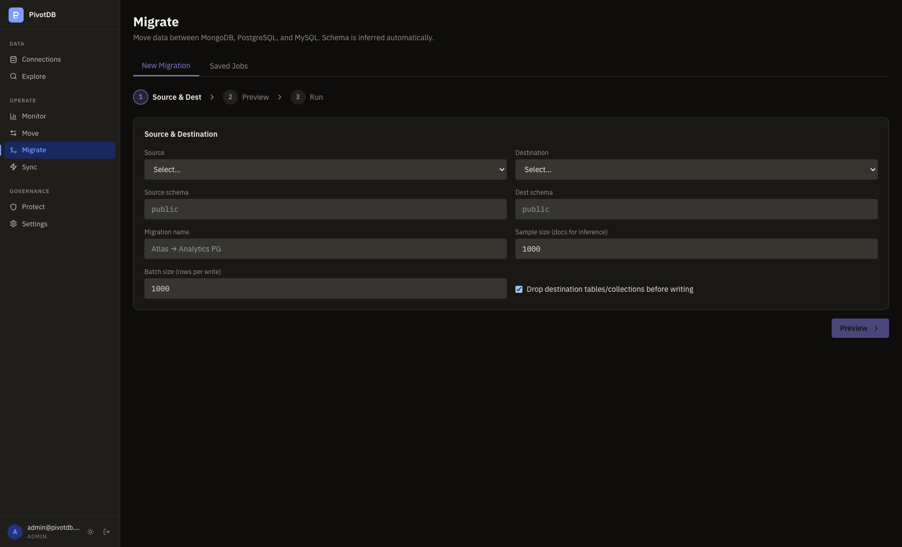

A three-step wizard — pick source and destination, preview the inferred schema, then run. Sample size controls how many documents are sampled to infer types; batch size controls rows per write.

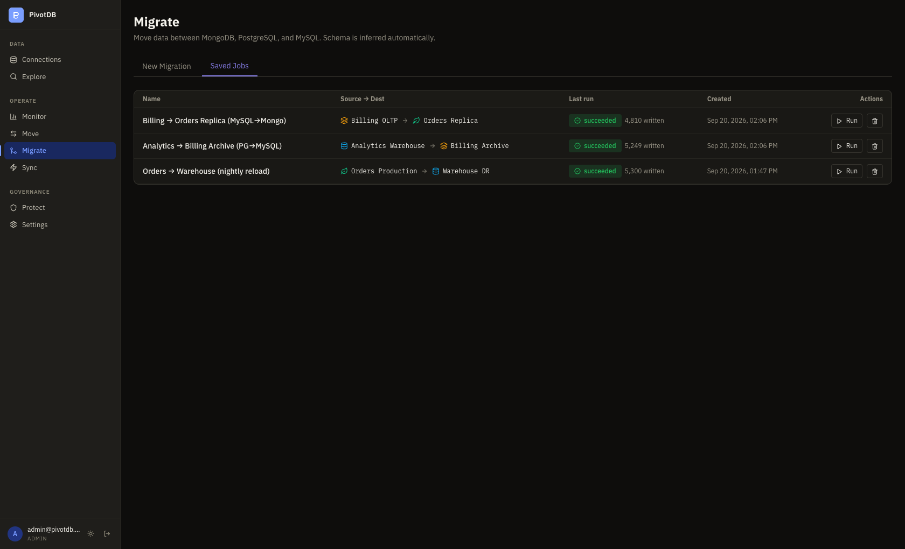

Three completed runs covering three of the nine directions: MongoDB → PostgreSQL (5,300 rows), PostgreSQL → MySQL (5,249) and MySQL → MongoDB (4,810). ObjectIds land as 24-char hex, nested documents as `JSONB`, and `AUTO_INCREMENT` columns as `IDENTITY`.

### Sync (CDC)

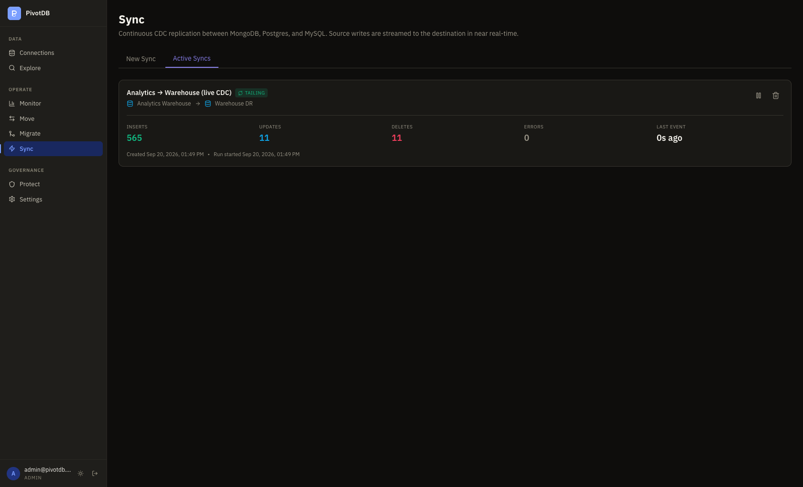

A live Postgres → Postgres sync in the `tailing` phase, reading WAL through a `pgoutput` replication slot. Counters are real events applied since the run started. The snapshot cursor is captured *before* the initial copy begins, so nothing written during the copy is missed.

### Monitor

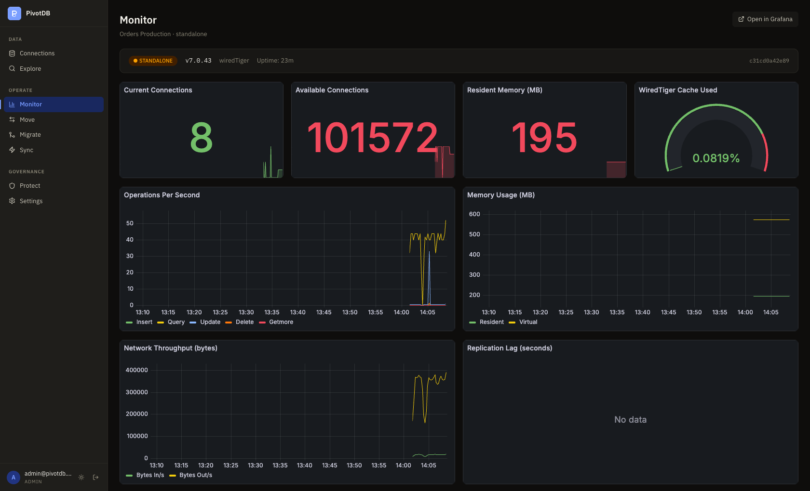

Engine-aware Grafana panels embedded per connection, backed by Prometheus scraping `/metrics` every 15s. Ops/sec is derived by differencing cumulative `opcounters` between scrapes. *(Replication Lag reads "No data" because this fixture is a standalone `mongod` with no replica set.)*

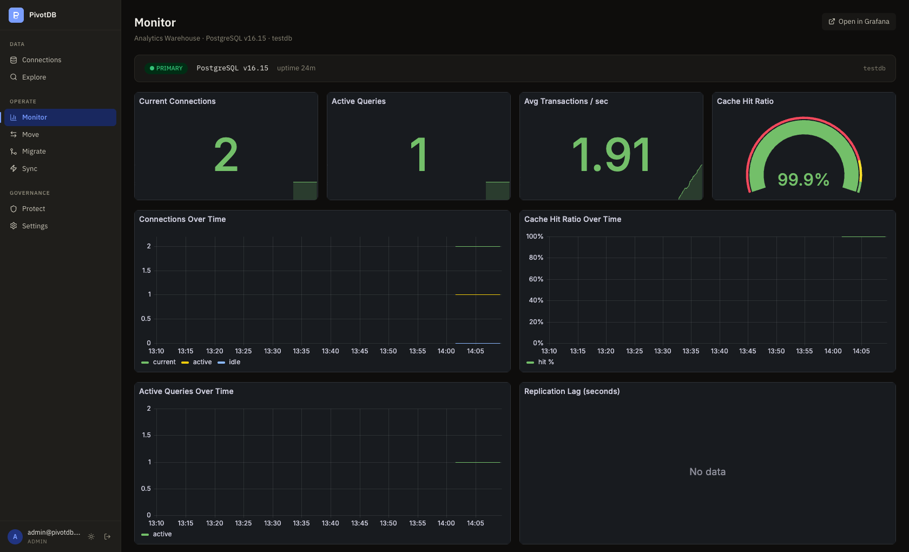

The same page against Postgres resolves to a different dashboard entirely — transactions/sec, cache hit ratio and active queries in place of the WiredTiger and opcounter panels. Mongo metrics are exported under `mongodb_*` and SQL metrics under `sqlmon_*` from two separate registries.

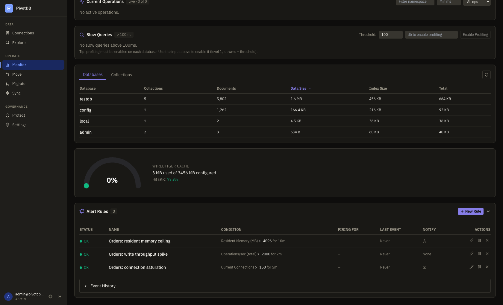

Further down the same page: live current-ops, slow queries via the profiler, database sizes, the WiredTiger cache gauge, and threshold alert rules. Each rule has a duration debounce, so a momentary spike will not fire it.

### Protect

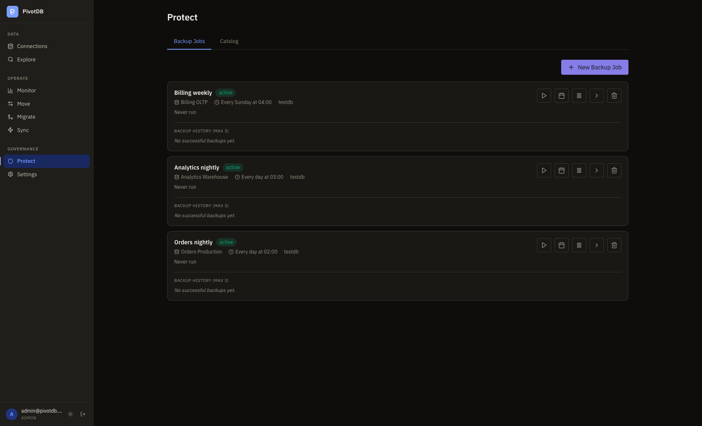

Scheduled backups per connection, driven by `mongodump` / `pg_dump` / `mysqldump` and written as AES-256-GCM encrypted archives. *(These show "Never run" because the native dump tools ship in the API Docker image, not on the host used for this capture.)*

### Settings and sign-in

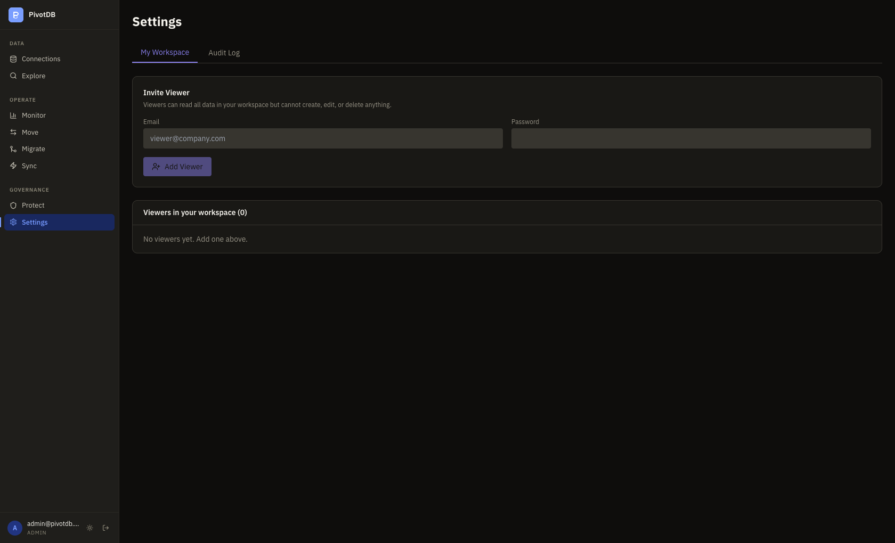

Workspace administration — invite read-only viewers, and an audit log tab. Everything is scoped to the signed-in user's profile; a `superadmin` sees across all profiles, an `admin` only their own, and a `viewer` is blocked from every write.

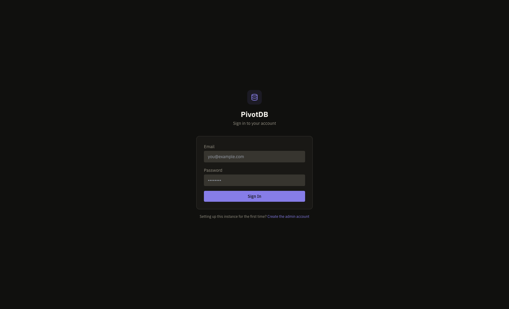

On a fresh instance this redirects to sign-up instead, to create the first superadmin.

## Architecture

```
Browser (Vite/React)
  ├── REST API      → Fastify API (3001)
  ├── Socket.IO     → Fastify API
  └── Grafana iframe → Grafana (3003, served read-only)

Fastify API (3001)
  ├── /api/connections      multi-engine CRUD + probe
  ├── /api/.../explore      schema discovery, query
  ├── /api/.../monitor      mongo snapshot, currentops, slow queries
  ├── /api/.../sql/monitor  pg/mysql snapshot, active queries, top tables
  ├── /api/migration-v2     plan + run cross-engine migrations
  ├── /api/cdc-sync         create/start/pause CDC sync jobs
  ├── /api/backup           scheduled backups, manual run, retention
  ├── /api/restore          restore a backup archive to any compatible target
  ├── /api/alerts           alert rules + events
  └── /metrics              Prometheus text format

BullMQ workers (single process)
  ├── migration-v2          streaming Reader → Mapper → Writer pipeline
  ├── cdc-sync              persistent tail with auto-retry + cursor checkpoint
  ├── backup                tar + gzip + AES-GCM, writes to /app/backups
  └── restore               decrypt + extract + invoke engine restore tool

Postgres (5432)  metadata: connections, jobs, rules, runs (Prisma)
Redis    (6379)  BullMQ queue
Prometheus (9090) scrapes /metrics every 15 s
Grafana    (3003) reads Prometheus, provisioned dashboards per engine
```

## Prerequisites

- Node.js 20+
- pnpm 9 (`npm install -g pnpm@9`)
- Docker Desktop

## Quick start (local dev)

```bash
# 1. Clone and enter
cd pivotdb

# 2. Copy + fill env
cp .env.example .env
# Edit .env — generate ENCRYPTION_KEY, JWT_SECRET, BACKUP_ENCRYPTION_KEY:
#   openssl rand -hex 32

# 3. Start infrastructure (postgres + redis + prometheus + grafana)
docker compose up -d postgres redis prometheus grafana

# 4. Install + migrate
pnpm install
pnpm --filter api db:migrate

# 5. Run dev servers
pnpm dev
```

| Service | URL |
|---|---|
| Web UI | http://localhost:5173 |
| API | http://localhost:3001 |
| Grafana | http://localhost:3003 |
| Prometheus | http://localhost:9090 |

## Environment variables

| Variable | Required | Purpose |
|---|---|---|
| `ENCRYPTION_KEY` | ✅ | AES-256-GCM key for connection URIs in the metadata DB (64-char hex) |
| `JWT_SECRET` | ✅ | JWT signing key (64-char hex) |
| `BACKUP_ENCRYPTION_KEY` | recommended | AES-256-GCM key for backup archives. Without it backups land as plain `.tar.gz` |
| `BACKUP_DIR` | no (default `/app/backups`) | Where backup archives are written. Must be on a persistent volume in prod |
| `POSTGRES_PASSWORD` | ✅ | Metadata DB password |
| `DATABASE_URL` | ✅ | Prisma connection string to the metadata DB |
| `REDIS_URL` | ✅ | BullMQ connection (defaults to `redis://redis:6379` in compose) |
| `SCHEDULER_TZ` | no (default `UTC`) | Timezone for cron schedules (e.g. `Asia/Kolkata`) |
| `GRAFANA_ADMIN_USER` / `GRAFANA_ADMIN_PASSWORD` | no | Grafana credentials |
| `SMTP_HOST` / `SMTP_PORT` / `SMTP_USER` / `SMTP_PASS` / `SMTP_FROM` | no | Email channel for alerts |

Generate the three encryption secrets:
```bash
openssl rand -hex 32   # ENCRYPTION_KEY
openssl rand -hex 32   # JWT_SECRET
openssl rand -hex 32   # BACKUP_ENCRYPTION_KEY
```

⚠️ **Lose `BACKUP_ENCRYPTION_KEY` and every encrypted backup becomes unreadable forever.** Store it the same way you'd store a master password.

## Production deployment

The app is designed to be deployed via `docker-compose.yml` on any platform that supports Compose — Coolify, Dokku, plain `docker compose up`, etc.

```bash
docker compose up --build -d
```

Coolify users: set the build pack to **Docker Compose**, point at the repo root, and provision env vars in the dashboard. The API container's CMD runs `prisma migrate deploy` on every start, so migrations apply automatically.

### Persistent volumes

The compose file declares five volumes; **all four marked critical must be persisted by your hosting platform**:

| Volume | Mount | Critical? |
|---|---|---|
| `postgres-data-v2` | `/var/lib/postgresql/data` | ✅ Critical — app metadata |
| `redis-data` | `/data` | Important — in-flight jobs |
| `backup-data` | `/app/backups` | ✅ Critical — your backup archives |
| `grafana-data` | `/var/lib/grafana` | Optional — dashboards/users |
| `prometheus-data-v2` | `/prometheus` | Optional — metrics history |

## Migration directions verified end-to-end

Tested against real cloud DBs (Neon Postgres, MongoDB Atlas, Aiven MySQL) with 65 k+ rows:

|  | → Mongo | → Postgres | → MySQL |
|---|---|---|---|
| **Mongo →** | (same engine) | ✅ | ✅ |
| **Postgres →** | ✅ | (same engine) | ✅ |
| **MySQL →** | ✅ | ✅ | (same engine) |

Same-engine pairs (`Mongo→Mongo`, `PG→PG`, `MySQL→MySQL`) also work — just identity-map the schema.

## Adding your first connection

1. Open the web UI — on first run you'll be redirected to a setup page to create the admin account (this only works once; after that, sign in and invite additional users from Settings)
2. **Connections → + New connection**
3. Pick engine (Mongo / Postgres / MySQL), paste a connection URI
4. **Test** — verify version, latency, and replica/cluster info
5. **Save**

Within 15 s Prometheus picks up the first scrape; open **Monitor** to see live charts.

## Provider notes

The system is verified against these managed cloud providers; gotchas you may hit:

| Provider | What works | What needs config |
|---|---|---|
| **MongoDB Atlas (M0 free)** | Connections, migrations, sync, backup/restore | Add `0.0.0.0/0` to Network Access for self-hosted deploys |
| **Neon Postgres** | All features incl. CDC | Enable **Logical replication** in project settings (off by default). Free tier idle-closes replication connections — handled by our auto-retry |
| **Aiven MySQL** | Connections, migrations, backup/restore | Custom port (not 3306). `--set-gtid-purged=OFF` is NOT used because we ship mariadb-client (Aiven free tier doesn't use GTID anyway) |

## Repository layout

```
apps/
  api/          Fastify backend + BullMQ workers + Prisma schema
  web/          React + Vite + Tailwind frontend
config/
  prometheus/   Scrape config + Dockerfile
  grafana/      Provisioned dashboards (mongo / pg / mysql)
dev/
  real-dbs/     Cloud DB seed scripts (mongo/pg/mysql) for end-to-end testing
  test-dbs/     Local Docker Compose with 6 test DBs for migration matrix testing
docker-compose.yml             production
docker-compose.dev.yml         dev overrides
```

## License

Private — © 2026 Innovativus.
